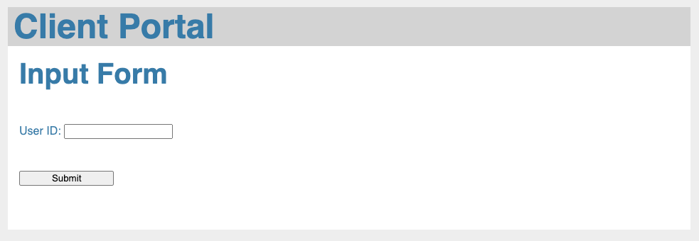
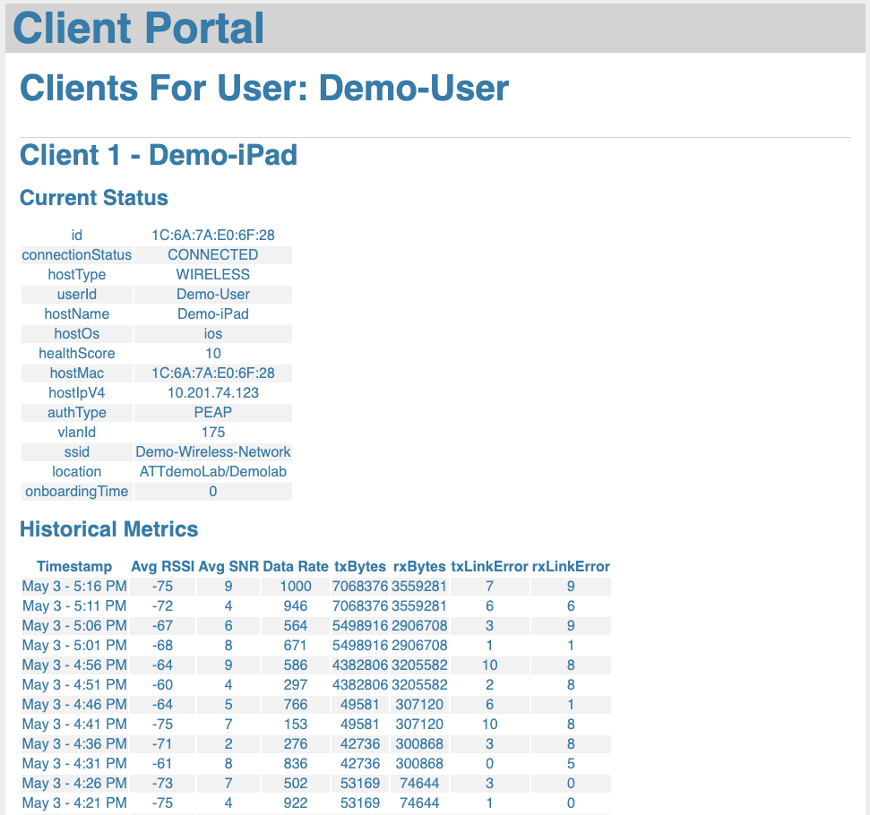

# dnac-client-page
Pulls data from DNA Center to create a client facing status page.  

## Setup Environment
Install the necessary Python packages in your environment.  
```
pip install -r requirements.txt 
```
Copy ***creds_example.json*** to ***creds.json*** and populate it with the relevant data for your DNA-Center.  

## Modify Test Parameters
Setting the variable ***use_static_data=True*** will cause the script to load cached data from a local JSON file.  This is useful when testing the interface, so as to avoid calls to DNA-Center for each refresh.  

Setting the variable ***use_static_client_id=True*** will cause the script to query DNA-Center, but using statically defined parameters instead of the user input.  This is useful when testing in a development environment with limited users.  
If using ***use_static_client_id=True***, then you must also hard code the test parameters ***entity_type*** (either 'mac_address' or 'network_user_id') and ***entity_value*** (the associated value).  

If ***use_static_data=False*** and ***use_static_client_id=False*** then the script will run in normal production mode querying the DNA-Center API with the user input each time.  

## Run Flask
Start the Flask Server using the shell script ***start_flask.sh*** or the appropriate commands for your platform.  
https://flask.palletsprojects.com/en/2.1.x/quickstart/


## Example


